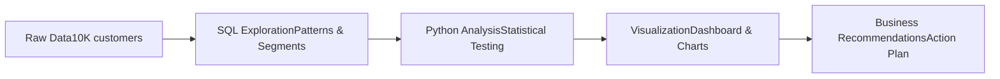

# 💳 Bank Customer Churn Analysis

**Identifying the patterns behind why customers leave—and how banks can keep them.**


---

## 🎯 The Problem

Customer churn represents a significant cost driver for retail banks, while industry estimates consistently show that customer acquisition is materially more expensive than retention. This analysis focuses on identifying the behavioral and service-related factors that precede churn, enabling earlier, data-driven retention interventions.

This project is inspired by real-world examples of data-driven customer service and retention initiatives in banking, demonstrating how analytics can support better customer outcomes.

---

## 💼 Business Impact

**The Opportunity:**
- 15-25% annual churn rate is standard in retail banking
- $250-500 cost to acquire each new customer  
- Early intervention can improve retention by 10-20%

**This Analysis Provides:**
- Risk scoring framework for customer segments
- Data-driven intervention triggers for retention campaigns
- ROI justification for retention investments

---

## 🔄 Analysis Pipeline


*Approach: Descriptive → Diagnostic → Predictive insights*

---

## 🔍 Research Questions

- Do higher account balances predict customer loyalty?
- Which demographic segments are highest risk?
- How does geography influence churn rates?
- What behaviors signal imminent churn?
- Which customers should retention campaigns target first?

---

## 📊 Dataset

**Source:** [Kaggle - Bank Customer Churn Prediction](https://www.kaggle.com/datasets/shantanudhakadd/bank-customer-churn-prediction)  
**Size:** 10,000 records × 14 features  
**License:** CC0 Public Domain  
**Period:** 2021 (patterns remain relevant to current retention strategies)

**Target Variable:** `Exited` (1 = churned, 0 = retained)

<details>
<summary>📋 View Data Dictionary</summary>

| Feature | Type | Description |
|---------|------|-------------|
| CustomerId | int | Unique customer identifier |
| Geography | string | Customer location (France, Germany, Spain) |
| Gender | string | Customer gender |
| Age | int | Customer age in years |
| Tenure | int | Years with the bank |
| Balance | float | Current account balance |
| NumOfProducts | int | Number of bank products used (1-4) |
| HasCrCard | binary | Has credit card (1) or not (0) |
| IsActiveMember | binary | Actively uses account (1) or dormant (0) |
| EstimatedSalary | float | Annual income estimate |
| **Exited** | **binary** | **Target: Churned (1) or Retained (0)** |

</details>

---

## 💡 Sample Analysis
```sql
-- Example: Churn rate by account balance tier
SELECT 
  CASE 
    WHEN Balance = 0 THEN 'Zero Balance'
    WHEN Balance < 50000 THEN 'Low ($1-50K)'
    WHEN Balance < 100000 THEN 'Medium ($50-100K)'
    ELSE 'High ($100K+)'
  END as balance_tier,
  COUNT(*) as customer_count,
  ROUND(AVG(Exited) * 100, 1) as churn_rate_pct
FROM Churn_Modelling
GROUP BY balance_tier
ORDER BY churn_rate_pct DESC;
```

*Full analysis and findings in [reports/findings.md](reports/findings.md)*

---

## 🛠️ Tech Stack

| Category | Technologies |
|----------|-------------|
| **Database** | SQLite 3.x |
| **Analysis** | Python 3.8+, Pandas 2.0, NumPy |
| **Visualization** | Matplotlib, Seaborn, Plotly, Tableau |
| **Notebooks** | Jupyter Lab |
| **Version Control** | Git, GitHub |

*Infrastructure: Local development environment | Cloud-ready for AWS/GCP deployment*

---

## 📁 Repository Structure
```
bank-churn-analysis/
│
├── data/
│   ├── raw/                 # Original dataset (immutable)
│   └── processed/           # Cleaned data for analysis
│
├── sql/
│   ├── 01_exploration.sql   # Initial data exploration
│   ├── 02_segmentation.sql  # Customer segmentation queries
│   └── 03_analysis.sql      # Advanced analytical queries
│
├── notebooks/
│   ├── 01_eda.ipynb        # Exploratory data analysis
│   ├── 02_statistical.ipynb # Statistical testing
│   └── 03_modeling.ipynb    # Pattern recognition
│
├── reports/
│   ├── findings.md          # Detailed findings
│   └── recommendations.md   # Business recommendations
│
├── images/                  # Charts and visualizations
│
└── requirements.txt         # Python dependencies
```

---

## 🚀 Getting Started

### Prerequisites
```bash
Python 3.8+
SQLite 3.x
Jupyter Notebook
```

### Installation
```bash
# Clone repository
git clone https://github.com/portlar/bank-churn-analysis.git
cd bank-churn-analysis

# Install dependencies
pip install -r requirements.txt

# Launch Jupyter
jupyter lab
```

### Run Analysis
1. Start with `notebooks/01_eda.ipynb` for data exploration
2. Review SQL queries in `sql/` folder
3. Check `reports/` for findings and recommendations

---

## 📈 Current Status

**Phase:** Exploratory Data Analysis & SQL Querying  
**Completion:** ~20%  
**Next Steps:** Python statistical analysis → Segmentation → Visualization → Recommendations

*This is an active project. Watch this repo for updates.*

---

## 📬 Let's Connect

Interested in discussing this analysis or exploring collaboration opportunities?

**Silvia - Portlar**  
📧 mailhome761@gmail.com  


---

### 🌟 If You Find This Useful

- ⭐ Star this repository
- 🔄 Share with others in data analytics
- 💬 Open an issue to discuss methodology or findings

---

## 📄 License

This project is open source and available under the [MIT License](LICENSE).

Dataset: [CC0 Public Domain](https://creativecommons.org/publicdomain/zero/1.0/)

---

*Last updated: January 2026*
